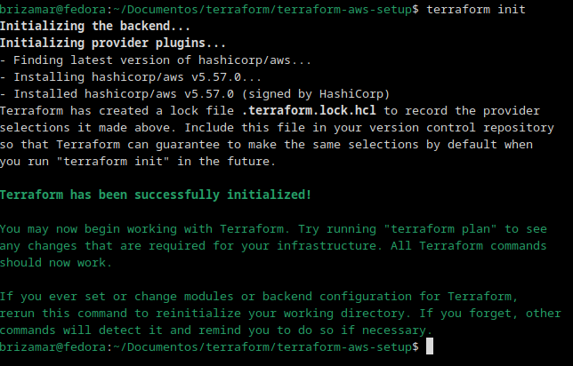
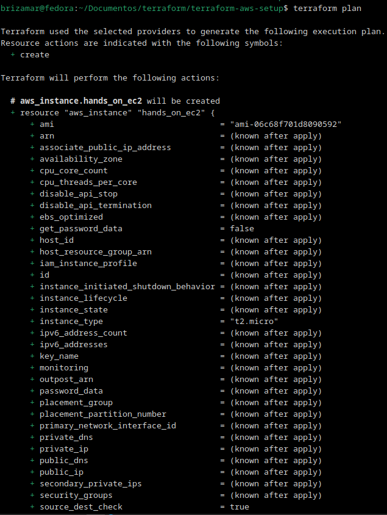
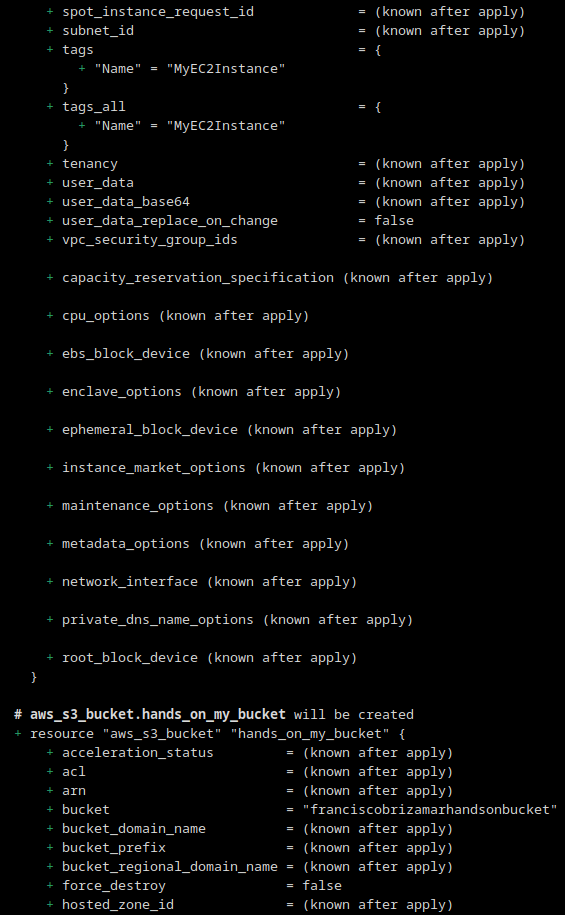
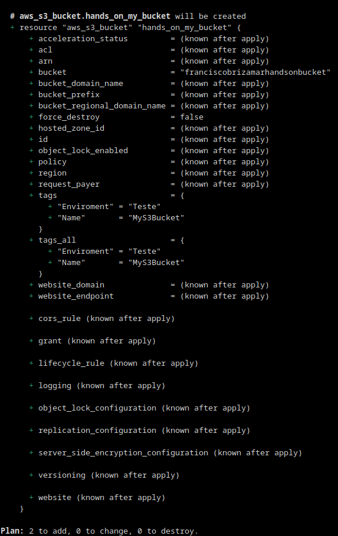
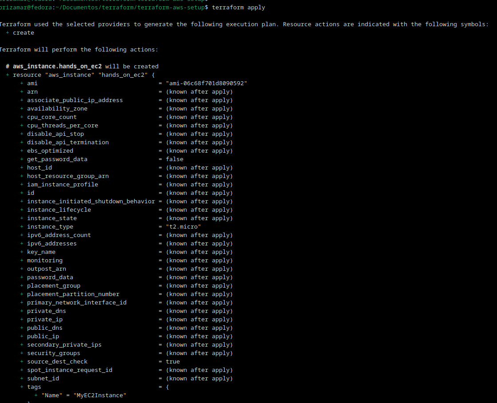
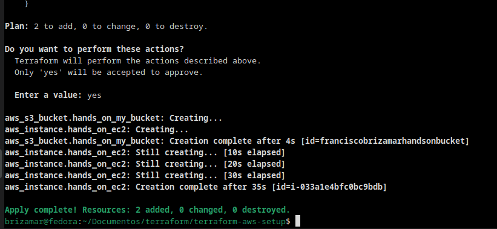
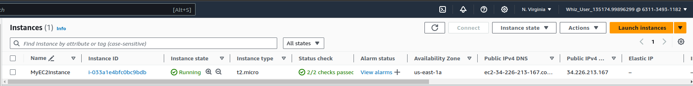
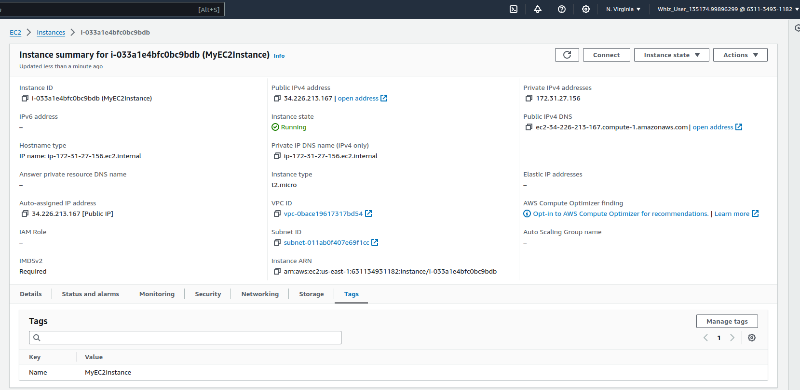
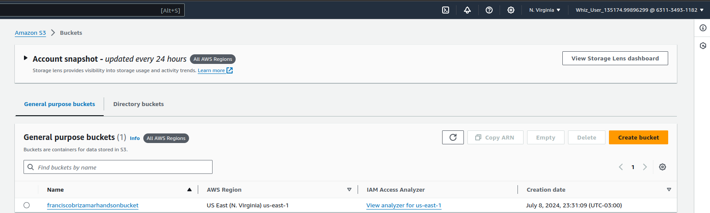
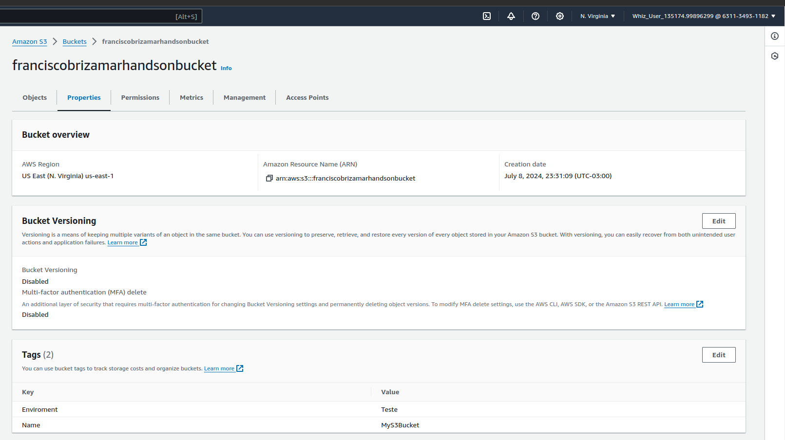

# terraform
Hands-On: Install Terraform and creat .tf file for up EC2 Instance and S3 Bucket

# Hands On
## Inicialização do Terraform

## O plano de execução do Terraform

 

 

## Aplicação do plano
 
 
## Verificação da instância EC2 e do bucket S3 criados pelo terraform
### EC2
 
### EC2 Tag
 
### Bucket S3
 
### Bucket S3 Tags
 
